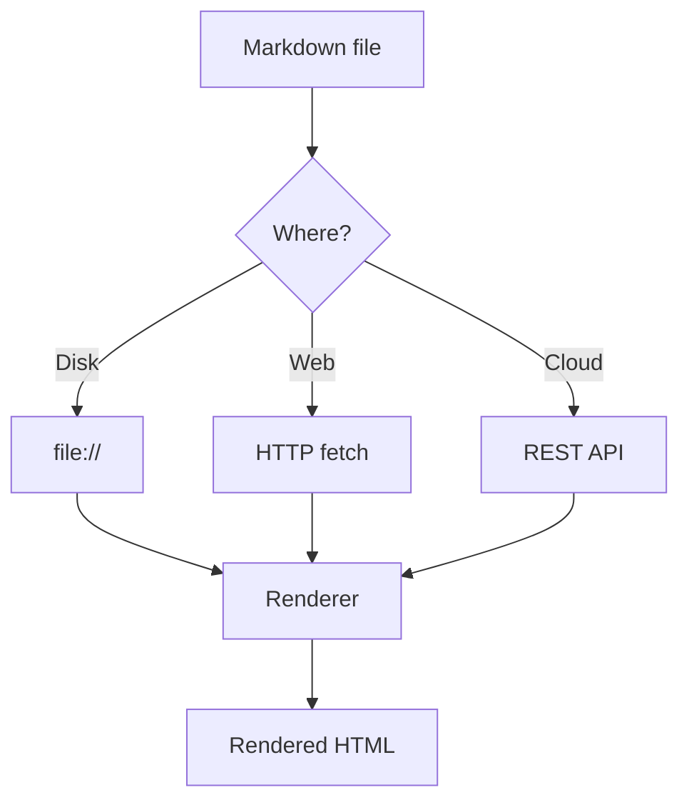
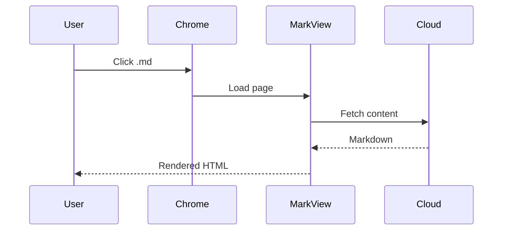

# Mermaid diagrams

MarkView renders every Mermaid diagram type directly inside the page — no
server round-trip.

## Flowchart

```mermaid
flowchart TD
    A[Markdown file] --> B{Where?}
    B -->|Disk| C[file://]
    B -->|Web| D[HTTP fetch]
    B -->|Cloud| E[REST API]
    C --> F[Renderer]
    D --> F
    E --> F
    F --> G[Rendered HTML]
```

## Sequence

```mermaid
sequenceDiagram
    User->>Chrome: Click .md
    Chrome->>MarkView: Load page
    MarkView->>Cloud: Fetch content
    Cloud-->>MarkView: Markdown
    MarkView-->>User: Rendered HTML
```
